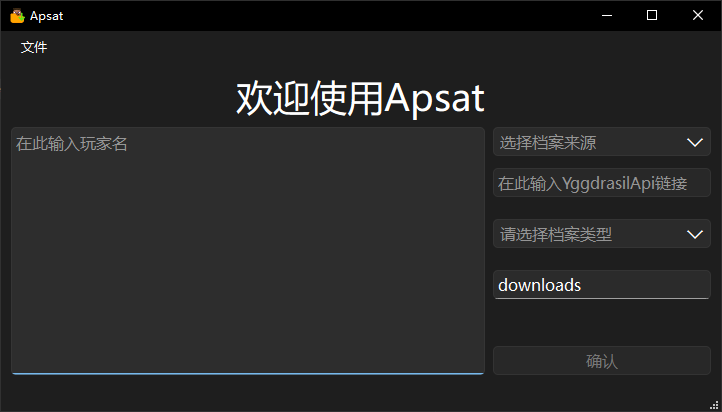

<div align="center">  </div><h1 align="center"> Automated Player Skin Acquisition Tool </h1>

> ***Tip: This README was translated by DeepSeek AI. If there are any errors, please report them in a GitHub Issue.***

---

## Description {#describe}
Automated Player Skin Acquisition Tool (hereinafter abbreviated as Apsat) is a GUI tool for saving custom skins, capes, and complete profiles from Minecraft player profiles (including Microsoft accounts and third-party Yggdrasil accounts).

Apsat has a fairly friendly GUI, is written using PyQt6, and offers a user-friendly input method. It can accept multiple Minecraft accounts for batch saving.

For compatibility, to ensure the GUI's visual quality, Apsat chooses Python 3.13.9, so users on Windows 7 and below cannot use this tool. If necessary, a version supporting Windows 7 and below will be released in the future.

> ### Apsat's GUI
> <div align="center"> <p>Running on Windows 10 19045.7663</p>  </div>

---

[English](README-en.md)<!--TODO: 替换为英文版链接--> | [简体中文](README.md)

## Usage {#usage}
### You can use Apsat in the following ways:
- Run directly

- Download the binary from GitHub Release

- Build the Apsat binary yourself

### Run Directly {#usage-run}
1. Download the source files from Apsat's [GitHub homepage]()<!--TODO: Add GitHub homepage link-->

2. Download uv:

    - Linux and macOS:

    ```bash
    curl -LsSf https://astral.sh/uv/install.sh | sh
    ```
    - Windows:

    ```bash
    powershell -ExecutionPolicy ByPass -c "irm https://astral.sh/uv/install.ps1 | iex"
    ```

3. Run the following commands in the project root directory to configure the environment:

```bash
# Create a virtual environment
uv venv -p 3.13.9

# Install dependencies
uv sync --no-group dev
```

4. Run the following command in the project root directory to run the project:

```bash
uv run src/main.py
```

---

### GitHub Release {#usage-github-release}

In Apsat's [GitHub Release]()<!--TODO: Add GitHub Release link-->, choose a version to download according to your device.

---

### Build It Yourself {#usage-build}
1. Download the source files from Apsat's GitHub homepage<!--TODO: Add GitHub homepage link-->


2. Download uv:

    - Linux and macOS:

    ```bash
    curl -LsSf https://astral.sh/uv/install.sh | sh
    ```

    - Windows:

    ```bash
    powershell -ExecutionPolicy ByPass -c "irm https://astral.sh/uv/install.ps1 | iex"
    ```

3. Download a compiler

    - Linux:

    ```bash
    # Debian / Ubuntu:
    sudo apt update
    sudo apt install build-essential python3-dev

    # Fedora / RHEL:
    sudo dnf install gcc gcc-c++ make python3-devel

    # Arch / Manjaro:
    sudo pacman -S base-devel
    ```

    - Windows:
    You can download MSVC through [Visual Studio](https://visualstudio.microsoft.com/en-us/downloads/).


4. Run the following commands in the project root directory to configure the environment:

```bash
# Create a virtual environment
uv venv -p 3.13.9

# Install dependencies
uv sync --no-group dev
```

5. Run the following commands in the project root directory to run the project and check the environment:

```bash
# Run the main file. If a window appears, PyQt6 was installed successfully.
uv run src/main.py

# If it contains nuitka, Nuitka was installed successfully.
uv tree
```

6. Run the following commands in the project root directory to build the project. The build artifacts are in the dist folder:

```bash
# Windows:
uv run nuitka --standalone --enable-plugin=pyqt6 --windows-console-mode=disable --output-dir=dist --jobs=4 --lto=yes --nofollow-import-to=pytest,ruff --msvc=latest --noinclude-qt-translations --windows-icon-from-ico=assets/icon.ico --output-filename=apsat --onefile src/main.py

# Linux:
uv run nuitka --standalone --enable-plugin=pyqt6 --windows-console-mode=disable --output-dir=dist --jobs=$(nproc) --lto=yes --nofollow-import-to=pytest,ruff --noinclude-qt-translations --output-filename=apsat --onefile src/main.py
```

---

## License {#license}
Apsat is released under the [GNU GPLv3](https://www.gnu.org/licenses/gpl-3.0.html) open-source license.